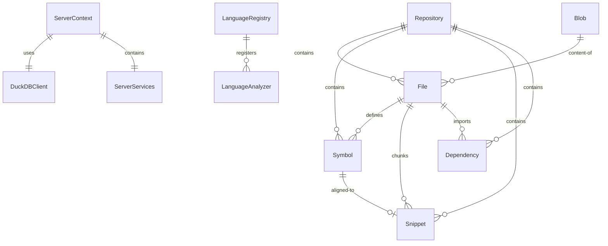
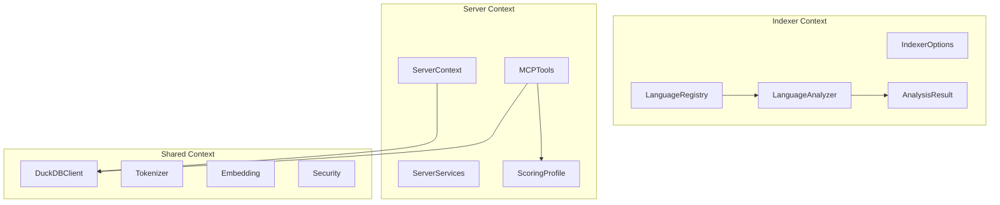
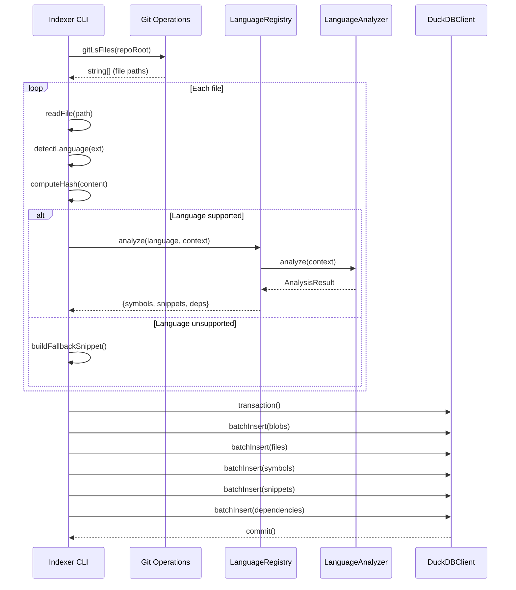
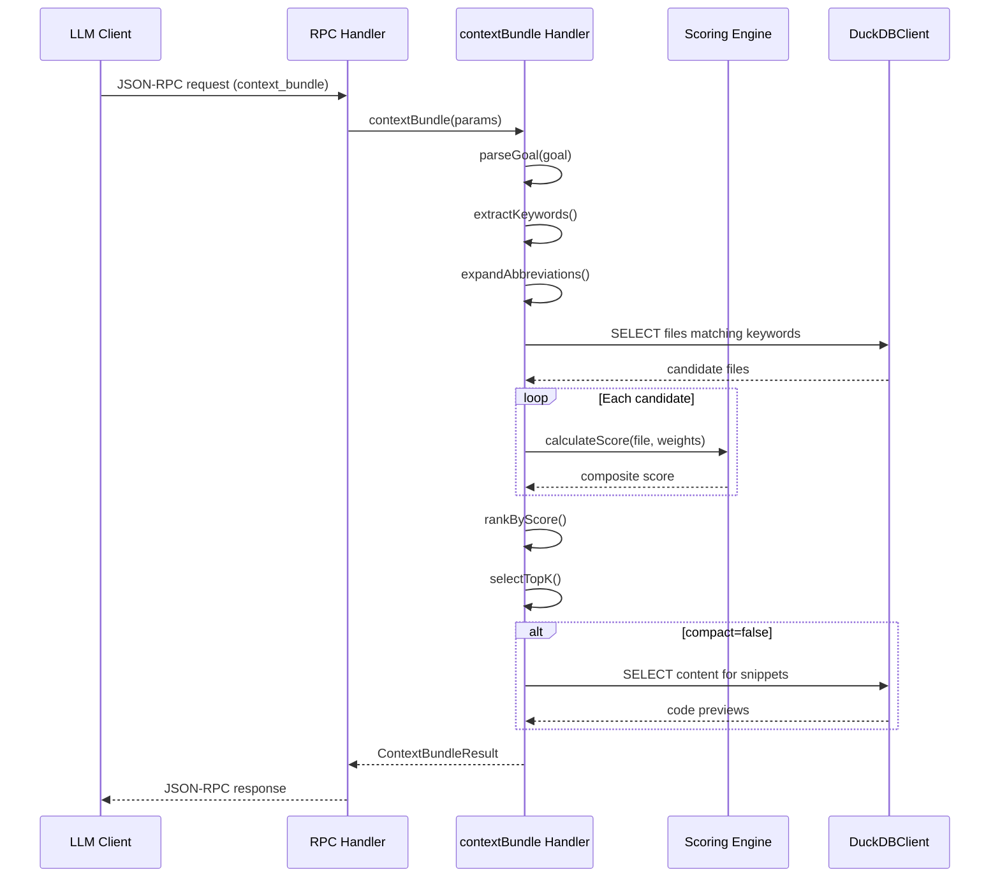
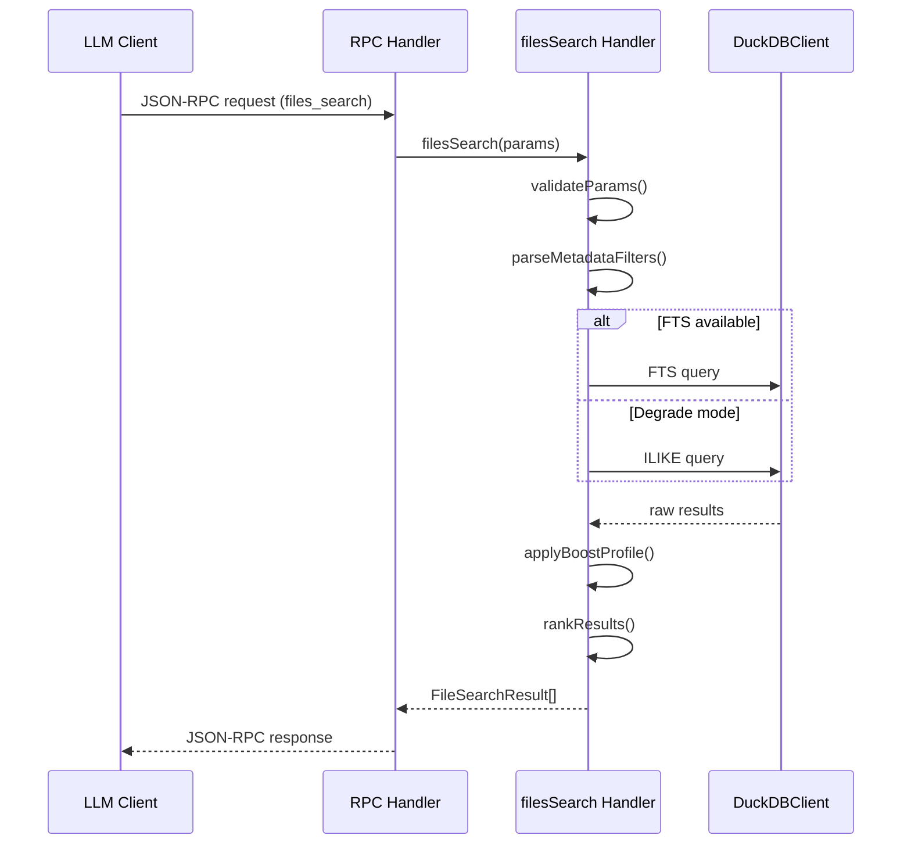
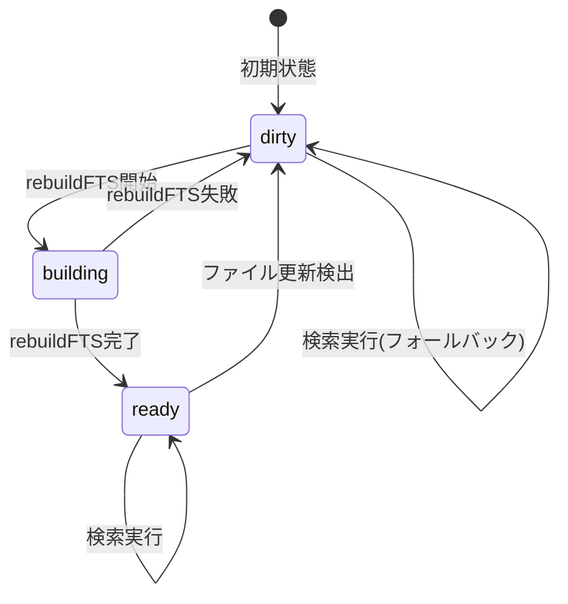
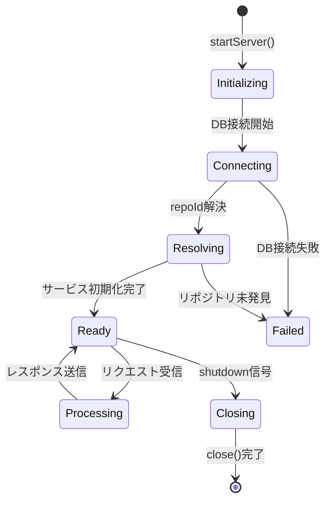
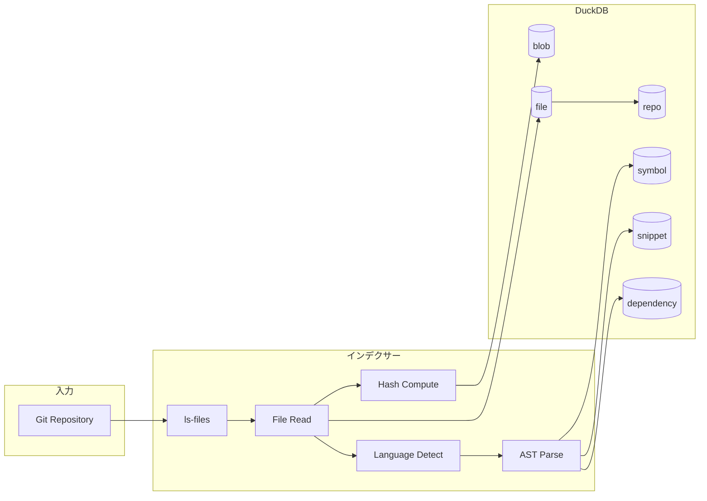

# 詳細設計書: KIRI - LLMコンテキスト抽出プラットフォーム

## 1. 概要

### 1.1 目的

本設計書は、KIRI（LLM向けコンテキスト抽出プラットフォーム）の詳細設計を記述する。KIRIは、Gitリポジトリをインデックス化し、MCP（Model Context Protocol）ツールを通じてセマンティックコード検索を提供するシステムである。

### 1.2 スコープ

本設計書が対象とする範囲：

1. **インデクサーレイヤー**: Gitワークツリーのスキャン、メタデータ抽出、言語解析
2. **MCPサーバーレイヤー**: JSON-RPC 2.0ハンドラ、検索ツール、スコアリング
3. **共有レイヤー**: DuckDBクライアント、トークナイザー、ユーティリティ
4. **データモデル**: blob/tree分離パターン、シンボル/スニペット構造

### 1.3 設計原則

| 原則              | 説明                             |
| ----------------- | -------------------------------- |
| Degrade-First     | FTS/VSS拡張なしでも動作する      |
| Token Efficiency  | LLMトークン消費を最小化する      |
| Content-Addressed | Git同様のハッシュベース重複排除  |
| Symbol-Aligned    | コード構造に沿ったスニペット境界 |

### 1.4 品質目標

| メトリクス      | 目標値  | 説明                        |
| --------------- | ------- | --------------------------- |
| P@10            | >= 0.7  | 上位10件中7件以上が有用     |
| TTFU            | <= 1.0s | 最初の有用結果まで1秒以内   |
| Token Reduction | >= 40%  | ファイル全体送信比で40%削減 |

---

## 2. 用語定義（ユビキタス言語）

### 2.1 ドメイン用語

| 用語       | 英語       | 定義                                      |
| ---------- | ---------- | ----------------------------------------- |
| リポジトリ | Repository | インデックス対象のGitリポジトリ           |
| ブロブ     | Blob       | ハッシュで一意に識別されるファイル内容    |
| ツリー     | Tree       | コミット時点でのパス→ブロブのマッピング   |
| シンボル   | Symbol     | AST抽出されたコード要素（クラス、関数等） |
| スニペット | Snippet    | シンボル境界に沿ったコードチャンク        |
| 依存関係   | Dependency | import/requireによるファイル間の関係      |

### 2.2 技術用語

| 用語 | 英語                       | 定義                               |
| ---- | -------------------------- | ---------------------------------- |
| MCP  | Model Context Protocol     | LLMとツール間の通信プロトコル      |
| FTS  | Full-Text Search           | DuckDBの全文検索拡張               |
| VSS  | Vector Similarity Search   | ベクトル類似検索拡張               |
| BM25 | Best Match 25              | 情報検索のスコアリングアルゴリズム |
| IDF  | Inverse Document Frequency | 単語の希少性を表す指標             |

### 2.3 操作用語

| 用語                 | 英語           | 定義                             |
| -------------------- | -------------- | -------------------------------- |
| インデックス作成     | Indexing       | リポジトリをDuckDBに取り込む処理 |
| コンテキストバンドル | Context Bundle | 目標に基づくコード探索結果       |
| ファイル検索         | Files Search   | キーワードによるファイル検索     |
| スニペット取得       | Snippets Get   | パス指定によるコード断片取得     |
| 依存関係クロージャ   | Deps Closure   | 依存グラフの走査                 |

---

## 3. 意味グラフ

### 3.1 概念モデル図



### 3.2 エンティティ定義

#### 3.2.1 Repository（リポジトリ）

```typescript
interface Repository {
  id: number; // 自動採番ID
  root: string; // 絶対パス（一意）
  normalized_root: string; // 正規化パス
  default_branch: string; // デフォルトブランチ名
  indexed_at: Date; // 最終インデックス日時
  fts_status: "dirty" | "building" | "ready";
  fts_generation: number; // FTSバージョン
}
```

#### 3.2.2 Blob（ブロブ）

```typescript
interface Blob {
  hash: string; // SHA-256ハッシュ（PRIMARY KEY）
  size_bytes: number; // ファイルサイズ
  line_count: number; // 行数（バイナリはnull）
  content: string | null; // 内容（バイナリはnull）
}
```

#### 3.2.3 File（ファイル）

```typescript
interface File {
  repo_id: number; // リポジトリID
  path: string; // 相対パス
  blob_hash: string; // ブロブハッシュ
  ext: string; // 拡張子
  lang: string; // 検出言語
  is_binary: boolean; // バイナリフラグ
  mtime: Date; // 更新日時
}
```

#### 3.2.4 Symbol（シンボル）

```typescript
interface Symbol {
  repo_id: number;
  path: string;
  symbol_id: number; // ファイル内連番（1始まり）
  name: string; // シンボル名
  kind: SymbolKind; // 種類
  range_start_line: number; // 開始行（1始まり）
  range_end_line: number; // 終了行（1始まり）
  signature: string; // シグネチャ（最大200文字）
  doc: string; // ドキュメントコメント
}

type SymbolKind =
  | "class"
  | "interface"
  | "enum"
  | "struct"
  | "function"
  | "method"
  | "property"
  | "variable"
  | "type"
  | "protocol"
  | "extension"
  | "trait";
```

#### 3.2.5 Snippet（スニペット）

```typescript
interface Snippet {
  repo_id: number;
  path: string;
  snippet_id: number; // ファイル内連番
  start_line: number; // 開始行（1始まり）
  end_line: number; // 終了行（1始まり）
  symbol_id: number | null; // 関連シンボル（任意）
}
```

#### 3.2.6 Dependency（依存関係）

```typescript
interface Dependency {
  repo_id: number;
  src_path: string; // ソースファイル
  dst_kind: "path" | "package"; // 依存先種別
  dst: string; // 依存先パスまたはパッケージ名
  rel: "import" | "require" | "dynamic"; // 関係種別
}
```

### 3.3 関係性定義

| 関係              | カーディナリティ | 説明                             |
| ----------------- | ---------------- | -------------------------------- |
| Repository → File | 1:N              | リポジトリは複数ファイルを含む   |
| File → Blob       | N:1              | 複数ファイルが同一内容を共有可能 |
| File → Symbol     | 1:N              | ファイルは複数シンボルを定義     |
| File → Snippet    | 1:N              | ファイルは複数スニペットに分割   |
| Symbol → Snippet  | 1:0..1           | シンボルはスニペットに対応可能   |
| File → Dependency | 1:N              | ファイルは複数の依存を持つ       |

### 3.4 コンテキスト境界



---

## 4. 機能設計

### 4.1 ユースケース

#### UC-01: リポジトリのインデックス作成

| 項目       | 内容                                                                         |
| ---------- | ---------------------------------------------------------------------------- |
| アクター   | 開発者                                                                       |
| 事前条件   | Gitリポジトリが存在する                                                      |
| 事後条件   | DuckDBにインデックスが作成される                                             |
| 基本フロー | 1. CLIでリポジトリパスを指定 → 2. ファイル列挙 → 3. 言語解析 → 4. DB書き込み |

#### UC-02: コンテキストバンドルの取得

| 項目       | 内容                                                                       |
| ---------- | -------------------------------------------------------------------------- |
| アクター   | LLMクライアント                                                            |
| 事前条件   | リポジトリがインデックス済み                                               |
| 事後条件   | 関連コードスニペットが返却される                                           |
| 基本フロー | 1. goal文字列を送信 → 2. キーワード抽出 → 3. スコアリング → 4. 上位K件返却 |

#### UC-03: ファイル検索

| 項目       | 内容                                                                            |
| ---------- | ------------------------------------------------------------------------------- |
| アクター   | LLMクライアント                                                                 |
| 事前条件   | リポジトリがインデックス済み                                                    |
| 事後条件   | マッチするファイル一覧が返却される                                              |
| 基本フロー | 1. query文字列を送信 → 2. ILIKE検索 → 3. ブーストプロファイル適用 → 4. 結果返却 |

#### UC-04: スニペット取得

| 項目       | 内容                                                                    |
| ---------- | ----------------------------------------------------------------------- |
| アクター   | LLMクライアント                                                         |
| 事前条件   | ファイルパスが既知                                                      |
| 事後条件   | 指定範囲のコードが返却される                                            |
| 基本フロー | 1. パスを送信 → 2. シンボル境界検索 → 3. 内容取得 → 4. 行番号付きで返却 |

#### UC-05: 依存関係クロージャの取得

| 項目       | 内容                                                                    |
| ---------- | ----------------------------------------------------------------------- |
| アクター   | LLMクライアント                                                         |
| 事前条件   | ファイルパスが既知                                                      |
| 事後条件   | 依存グラフが返却される                                                  |
| 基本フロー | 1. パスと方向を送信 → 2. BFS走査 → 3. ノード/エッジ収集 → 4. グラフ返却 |

### 4.2 シーケンス図

#### 4.2.1 インデックス作成フロー



#### 4.2.2 context_bundleフロー



#### 4.2.3 files_searchフロー



### 4.3 状態遷移図

#### 4.3.1 FTSステータス遷移



#### 4.3.2 サーバーライフサイクル



---

## 5. データ設計

### 5.1 エンティティスキーマ

#### 5.1.1 repoテーブル

```sql
CREATE TABLE repo (
    id INTEGER PRIMARY KEY DEFAULT nextval('repo_id_seq'),
    root TEXT NOT NULL UNIQUE,
    normalized_root TEXT,
    default_branch TEXT,
    indexed_at TIMESTAMP,
    fts_last_indexed_at TIMESTAMP,
    fts_dirty BOOLEAN DEFAULT false,
    fts_status TEXT DEFAULT 'dirty',
    fts_generation INTEGER DEFAULT 0
);
```

#### 5.1.2 blobテーブル

```sql
CREATE TABLE blob (
    hash TEXT PRIMARY KEY,
    size_bytes INTEGER,
    line_count INTEGER,
    content TEXT
);
```

#### 5.1.3 fileテーブル

```sql
CREATE TABLE file (
    repo_id INTEGER,
    path TEXT,
    blob_hash TEXT,
    ext TEXT,
    lang TEXT,
    is_binary BOOLEAN,
    mtime TIMESTAMP,
    PRIMARY KEY (repo_id, path)
);

CREATE INDEX idx_file_lang ON file(repo_id, lang);
```

#### 5.1.4 symbolテーブル

```sql
CREATE TABLE symbol (
    repo_id INTEGER,
    path TEXT,
    symbol_id BIGINT,
    name TEXT,
    kind TEXT,
    range_start_line INTEGER,
    range_end_line INTEGER,
    signature TEXT,
    doc TEXT,
    PRIMARY KEY (repo_id, path, symbol_id)
);

CREATE INDEX idx_symbol_name ON symbol(repo_id, name);
```

#### 5.1.5 snippetテーブル

```sql
CREATE TABLE snippet (
    repo_id INTEGER,
    path TEXT,
    snippet_id BIGINT,
    start_line INTEGER,
    end_line INTEGER,
    symbol_id BIGINT NULL,
    PRIMARY KEY (repo_id, path, snippet_id)
);
```

#### 5.1.6 dependencyテーブル

```sql
CREATE TABLE dependency (
    repo_id INTEGER,
    src_path TEXT,
    dst_kind TEXT,
    dst TEXT,
    rel TEXT,
    PRIMARY KEY (repo_id, src_path, dst_kind, dst, rel)
);

CREATE INDEX idx_dep_src ON dependency(repo_id, src_path);
```

### 5.2 データフロー



### 5.3 永続化戦略

#### 5.3.1 バッチ挿入

```typescript
const MAX_SQL_PLACEHOLDERS = 30000;

function calculateBatchSize(columnsPerRecord: number): number {
  return Math.floor(MAX_SQL_PLACEHOLDERS / columnsPerRecord);
}

// 例: symbolテーブル（9列）の場合
// batchSize = 30000 / 9 = 3333 records
```

#### 5.3.2 トランザクション管理

```typescript
await db.transaction(async () => {
  await batchInsert("blob", blobs);
  await batchInsert("file", files);
  await batchInsert("symbol", symbols);
  await batchInsert("snippet", snippets);
  await batchInsert("dependency", deps);
});
```

#### 5.3.3 WALチェックポイント

```typescript
async close(): Promise<void> {
    try {
        await this.run("CHECKPOINT");
    } catch {
        // 読み取り専用モードでは無視
    }
    this.connection.closeSync();
}
```

---

## 6. インターフェース設計

### 6.1 MCP API定義

#### 6.1.1 context_bundle

```typescript
interface ContextBundleParams {
  goal: string; // 必須: 検索目標
  limit?: number; // 最大結果数 (default: 7)
  compact?: boolean; // プレビュー省略 (default: true)
  boost_profile?: BoostProfileName;
  path_prefix?: string; // パス接頭辞フィルタ
  artifacts?: {
    editing_path?: string;
    failing_tests?: string[];
    last_diff?: string;
  };
  metadata_filters?: Record<string, string | string[]>;
  category?: AdaptiveKCategory;
}

interface ContextBundleResult {
  context: ContextEntry[];
  tokens_estimate?: number;
  warnings?: string[];
}

interface ContextEntry {
  path: string;
  range: [number, number]; // [startLine, endLine]
  preview?: string;
  why: string[]; // スコアリング理由
  score: number; // 正規化スコア (0-1)
}
```

#### 6.1.2 files_search

```typescript
interface FilesSearchParams {
  query?: string;
  lang?: string;
  ext?: string;
  path_prefix?: string;
  limit?: number; // default: 50
  boost_profile?: BoostProfileName;
  compact?: boolean;
  metadata_filters?: Record<string, string | string[]>;
}

interface FileSearchResult {
  path: string;
  matchLine: number;
  lang: string | null;
  ext: string;
  score: number;
  preview?: string;
}
```

#### 6.1.3 snippets_get

```typescript
interface SnippetsGetParams {
  path: string; // 必須
  start_line?: number;
  end_line?: number;
  compact?: boolean;
  include_line_numbers?: boolean;
  view?: "auto" | "symbol" | "lines" | "full";
}

interface SnippetResult {
  path: string;
  startLine: number;
  endLine: number;
  totalLines: number;
  symbolName: string | null;
  symbolKind: string | null;
  content?: string;
  truncated?: boolean; // view='full'で500行超過時
}
```

#### 6.1.4 deps_closure

```typescript
interface DepsClosureParams {
  path: string; // 必須
  direction?: "outbound" | "inbound"; // default: 'outbound'
  max_depth?: number; // default: 3
  include_packages?: boolean;
}

interface DepsClosureResult {
  root: string;
  direction: "outbound" | "inbound";
  nodes: DepsNode[];
  edges: DepsEdge[];
}

interface DepsNode {
  kind: "path" | "package";
  target: string;
  depth: number;
}

interface DepsEdge {
  from: string;
  to: string;
  kind: "path" | "package";
  rel: string;
  depth: number;
}
```

### 6.2 内部インターフェース

#### 6.2.1 DuckDBClient

```typescript
interface DuckDBClientOptions {
  databasePath: string;
  ensureDirectory?: boolean;
  autoGitignore?: boolean;
}

class DuckDBClient {
  static async connect(options: DuckDBClientOptions): Promise<DuckDBClient>;
  async run(sql: string, params?: QueryParams): Promise<void>;
  async all<T>(sql: string, params?: QueryParams): Promise<T[]>;
  async transaction<T>(fn: () => Promise<T>): Promise<T>;
  async close(): Promise<void>;
}
```

#### 6.2.2 LanguageAnalyzer

```typescript
interface LanguageAnalyzer {
  readonly language: string;
  analyze(context: AnalysisContext): Promise<AnalysisResult>;
  dispose?(): Promise<void>;
}

interface AnalysisContext {
  pathInRepo: string;
  content: string;
  fileSet: Set<string>;
  workspaceRoot?: string;
}

interface AnalysisResult {
  symbols: SymbolRecord[];
  snippets: SnippetRecord[];
  dependencies: DependencyRecord[];
  status?: "success" | "error" | "sdk_unavailable";
  error?: string;
}
```

### 6.3 イベント定義

#### 6.3.1 サーバーイベント

| イベント        | トリガー           | データ            |
| --------------- | ------------------ | ----------------- |
| server.start    | サーバー起動完了   | {port, repoId}    |
| server.request  | リクエスト受信     | {method, id}      |
| server.response | レスポンス送信     | {id, duration_ms} |
| server.error    | エラー発生         | {error, stack}    |
| server.shutdown | シャットダウン開始 | {}                |

#### 6.3.2 インデクサーイベント

| イベント         | トリガー         | データ               |
| ---------------- | ---------------- | -------------------- |
| indexer.start    | インデックス開始 | {repoRoot, full}     |
| indexer.progress | 進捗更新         | {processed, total}   |
| indexer.complete | インデックス完了 | {duration_ms, files} |
| indexer.error    | エラー発生       | {error, path}        |

---

## 7. 制約と不変条件

### 7.1 ビジネスルール

| ルールID | ルール                             | 根拠           |
| -------- | ---------------------------------- | -------------- |
| BR-01    | バイナリファイルの内容は保存しない | ストレージ効率 |
| BR-02    | シンボルIDはファイル内で一意       | 参照整合性     |
| BR-03    | スニペット範囲は重複しない         | クエリ効率     |
| BR-04    | パス走査攻撃を防止する             | セキュリティ   |
| BR-05    | 機密ファイルパターンを除外する     | セキュリティ   |

### 7.2 バリデーションルール

#### 7.2.1 パス検証

```typescript
const PATH_PATTERN = /^(?!.*\.\.)[A-Za-z0-9_./\-]+$/;

function validatePath(path: string): boolean {
  return PATH_PATTERN.test(path);
}
```

#### 7.2.2 機密ファイル除外

```typescript
const SENSITIVE_PATTERNS = [/\.env.*/, /.*\.pem$/, /^secrets\//, /credentials\.json$/];

function isSensitive(path: string): boolean {
  return SENSITIVE_PATTERNS.some((p) => p.test(path));
}
```

### 7.3 整合性制約

| 制約   | テーブル   | 条件                                    |
| ------ | ---------- | --------------------------------------- |
| PK     | repo       | id                                      |
| UNIQUE | repo       | root                                    |
| PK     | blob       | hash                                    |
| PK     | file       | (repo_id, path)                         |
| PK     | symbol     | (repo_id, path, symbol_id)              |
| PK     | snippet    | (repo_id, path, snippet_id)             |
| PK     | dependency | (repo_id, src_path, dst_kind, dst, rel) |
| CHECK  | snippet    | start_line <= end_line                  |
| CHECK  | symbol     | range_start_line <= range_end_line      |

---

## 8. 非機能要件対応

### 8.1 パフォーマンス考慮

#### 8.1.1 インデックス戦略

```sql
-- シンボル名検索の高速化
CREATE INDEX idx_symbol_name ON symbol(repo_id, name);

-- 言語別ファイル検索
CREATE INDEX idx_file_lang ON file(repo_id, lang);

-- 依存関係走査
CREATE INDEX idx_dep_src ON dependency(repo_id, src_path);
```

#### 8.1.2 バッチ処理

| 操作                 | バッチサイズ | 根拠      |
| -------------------- | ------------ | --------- |
| blobインサート       | 7500         | 30000/4列 |
| symbolインサート     | 3333         | 30000/9列 |
| dependencyインサート | 6000         | 30000/5列 |

#### 8.1.3 キャッシュ戦略

| キャッシュ               | TTL    | スコープ |
| ------------------------ | ------ | -------- |
| FTSステータス            | 10秒   | サーバー |
| スコアリングプロファイル | 起動時 | 永続     |
| ストップワード           | 起動時 | 永続     |

### 8.2 セキュリティ考慮

#### 8.2.1 入力検証

```typescript
// パストラバーサル防止
if (path.includes("..")) {
  throw new Error("Path traversal not allowed");
}

// SQLインジェクション防止（パラメータ化クエリ）
await db.all("SELECT * FROM file WHERE path = ?", [path]);
```

#### 8.2.2 出力マスキング

```typescript
import { maskValue } from "./security/masker.js";

// レスポンス内の機密値をマスク
const maskedResponse = maskValue(response, RESPONSE_MASK_SKIP_KEYS);
```

#### 8.2.3 機密ファイル保護

```typescript
const SENSITIVE_PATTERNS = [".env*", "*.pem", "secrets/**", "credentials.json"];
```

### 8.3 拡張性考慮

#### 8.3.1 言語アナライザーの追加

```typescript
// 1. LanguageAnalyzerインターフェースを実装
class NewLanguageAnalyzer implements LanguageAnalyzer {
  readonly language = "NewLang";
  async analyze(context: AnalysisContext): Promise<AnalysisResult> {
    // tree-sitterパーサーを使用
  }
}

// 2. LanguageRegistryに登録
registry.register(new NewLanguageAnalyzer());
```

#### 8.3.2 スコアリングプロファイルの追加

```yaml
# config/scoring-profiles.yaml
custom_profile:
  textMatch: 1.0
  pathMatch: 0.5
  dependency: 0.8
  # ... 他のウェイト
```

#### 8.3.3 ブーストプロファイルの追加

```yaml
# config/boost-profiles.yaml
custom_boost:
  path_multipliers:
    - pattern: "src/core/**"
      multiplier: 1.5
    - pattern: "tests/**"
      multiplier: 0.3
```

---

## 9. 実装ガイドライン

### 9.1 推奨パターン

#### 9.1.1 DuckDBClientの使用

```typescript
// 推奨: try-finallyでクローズを保証
const db = await DuckDBClient.connect({
  databasePath: "var/index.duckdb",
  ensureDirectory: true,
});
try {
  await db.transaction(async () => {
    await db.run("INSERT INTO ...", [params]);
  });
} finally {
  await db.close();
}
```

#### 9.1.2 エラーメッセージフォーマット

```typescript
// 推奨: "問題. 解決策."形式
throw new Error(
  "Target repository is missing from DuckDB. " + "Run the indexer before starting the server."
);
```

#### 9.1.3 トランザクション境界

```typescript
// 推奨: 論理的な操作単位でトランザクション
await db.transaction(async () => {
  // 全ファイルのデータを一括コミット
  await batchInsert("blob", blobs);
  await batchInsert("file", files);
  await batchInsert("symbol", symbols);
});
```

### 9.2 アンチパターン（避けるべき実装）

#### 9.2.1 生SQLの文字列連結

```typescript
// 禁止: SQLインジェクションの脆弱性
const sql = `SELECT * FROM file WHERE path = '${userInput}'`;

// 推奨: パラメータ化クエリ
const sql = "SELECT * FROM file WHERE path = ?";
await db.all(sql, [userInput]);
```

#### 9.2.2 無制限のバッチサイズ

```typescript
// 禁止: スタックオーバーフローの危険
await db.run(`INSERT INTO symbol VALUES ${allRecords.map(...)}`);

// 推奨: バッチサイズを制限
const batchSize = calculateBatchSize(9);
for (let i = 0; i < records.length; i += batchSize) {
    const batch = records.slice(i, i + batchSize);
    await insertBatch(batch);
}
```

#### 9.2.3 未検証のパス使用

```typescript
// 禁止: パストラバーサル攻撃が可能
const content = await fs.readFile(path.join(root, userPath));

// 推奨: パス検証後に使用
if (!validatePath(userPath)) {
  throw new Error("Invalid path");
}
const content = await fs.readFile(path.join(root, userPath));
```

### 9.3 テスト戦略

#### 9.3.1 テストカテゴリ

| カテゴリ | 対象        | ツール          |
| -------- | ----------- | --------------- |
| ユニット | 関数/クラス | Vitest          |
| 統合     | DB操作、API | Vitest + 一時DB |
| 評価     | 検索精度    | assay-kit       |

#### 9.3.2 テストDB管理

```typescript
import { mkdtemp, rm } from "node:fs/promises";
import { tmpdir } from "node:os";

let tempDir: string;
let db: DuckDBClient;

beforeEach(async () => {
  tempDir = await mkdtemp(path.join(tmpdir(), "kiri-test-"));
  db = await DuckDBClient.connect({
    databasePath: path.join(tempDir, "test.duckdb"),
  });
});

afterEach(async () => {
  await db.close();
  await rm(tempDir, { recursive: true });
});
```

#### 9.3.3 カバレッジ要件

| メトリクス     | 最小値 |
| -------------- | ------ |
| ステートメント | 80%    |
| ブランチ       | 80%    |
| 関数           | 80%    |
| 行             | 80%    |

---

## 10. 付録

### 10.1 サポート言語一覧

| 言語       | 拡張子    | アナライザー         | シンボル抽出                       |
| ---------- | --------- | -------------------- | ---------------------------------- |
| TypeScript | .ts, .tsx | TypeScript API       | class, interface, function, method |
| Swift      | .swift    | tree-sitter          | class, struct, protocol, func      |
| PHP        | .php      | tree-sitter          | class, interface, function, method |
| Java       | .java     | tree-sitter          | class, interface, method           |
| Rust       | .rs       | tree-sitter          | struct, enum, fn, impl             |
| Dart       | .dart     | Dart Analysis Server | class, function, method            |

### 10.2 設定ファイル一覧

| ファイル                     | 目的                   | 形式 |
| ---------------------------- | ---------------------- | ---- |
| config/scoring-profiles.yaml | スコアリング重み       | YAML |
| config/boost-profiles.yaml   | ファイルタイプブースト | YAML |
| config/domain-terms.yaml     | ドメイン用語展開       | YAML |
| config/stop-words.yaml       | ストップワード         | YAML |
| .kiri.yaml                   | プロジェクト設定       | YAML |

### 10.3 エラーコード一覧

| コード | メッセージ                 | 解決策                 |
| ------ | -------------------------- | ---------------------- |
| E001   | Repository not found       | インデクサーを実行     |
| E002   | Path traversal detected    | 有効なパスを指定       |
| E003   | Binary file not supported  | テキストファイルを指定 |
| E004   | Database connection failed | DBパスを確認           |
| E005   | FTS extension unavailable  | デグレードモードで動作 |

---

## 変更履歴

| バージョン | 日付       | 変更内容 |
| ---------- | ---------- | -------- |
| 1.0.0      | 2025-12-01 | 初版作成 |
