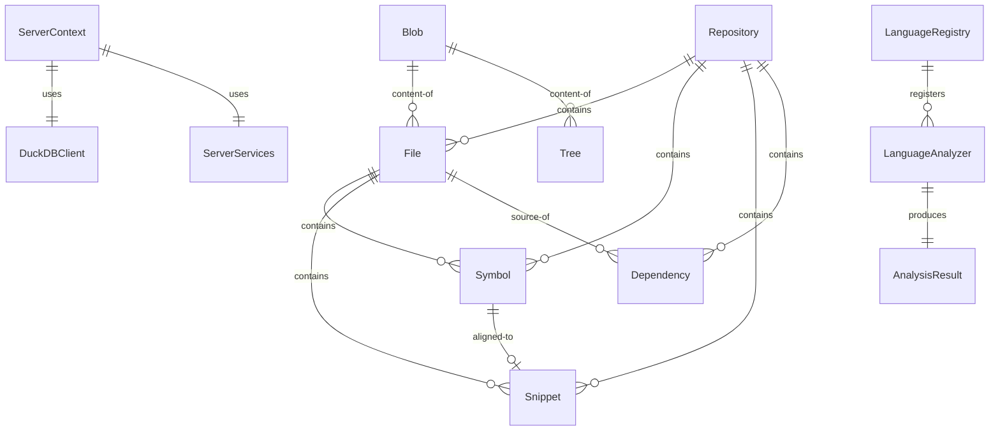
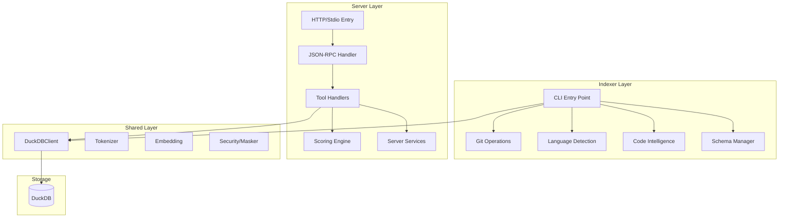

# KIRI Semantic Graph - Domain-Centric Contextual Analysis

## Overview

This document presents the semantic graph for KIRI, a context extraction platform for LLMs that indexes Git repositories into DuckDB and provides MCP (Model Context Protocol) tools for semantic code search.

---

## Semantic Graph Structure

```
[Semantic Graph: KIRI - LLM Context Extraction Platform]
```

---

## 1. Entities

### 1.1 Core Domain Entities

#### Repository

- **Description**: A Git repository that is indexed by KIRI
- **Attributes**:
  - id: INTEGER [PRIMARY KEY, auto-increment]
  - root: TEXT [UNIQUE, NOT NULL, absolute path]
  - normalized_root: TEXT [canonical path for matching]
  - default_branch: TEXT [e.g., "main", "master"]
  - indexed_at: TIMESTAMP
  - fts_status: TEXT ["dirty" | "building" | "ready"]
  - fts_generation: INTEGER [version counter]

#### Blob

- **Description**: Unique file content stored by hash (Git-style deduplication)
- **Attributes**:
  - hash: TEXT [PRIMARY KEY, SHA-256]
  - size_bytes: INTEGER
  - line_count: INTEGER [NULL for binary]
  - content: TEXT [NULL for binary]

#### Tree

- **Description**: Commit-to-path mapping (Git tree structure)
- **Attributes**:
  - repo_id: INTEGER [FK -> Repository]
  - commit_hash: TEXT
  - path: TEXT
  - blob_hash: TEXT [FK -> Blob]
  - ext: TEXT
  - lang: TEXT
  - is_binary: BOOLEAN
  - mtime: TIMESTAMP

#### File

- **Description**: HEAD state convenience view for fast queries
- **Attributes**:
  - repo_id: INTEGER [FK -> Repository]
  - path: TEXT [PRIMARY KEY with repo_id]
  - blob_hash: TEXT [FK -> Blob]
  - ext: TEXT [file extension]
  - lang: TEXT [detected language]
  - is_binary: BOOLEAN
  - mtime: TIMESTAMP

#### Symbol

- **Description**: AST-extracted code element (class, function, method, etc.)
- **Attributes**:
  - repo_id: INTEGER [FK -> Repository]
  - path: TEXT
  - symbol_id: BIGINT [auto-assigned within file]
  - name: TEXT [symbol name]
  - kind: TEXT ["class" | "function" | "method" | "interface" | "enum" | ...]
  - range_start_line: INTEGER [1-based]
  - range_end_line: INTEGER [1-based]
  - signature: TEXT [max 200 chars]
  - doc: TEXT [documentation comment]

#### Snippet

- **Description**: Code chunk aligned to symbol boundaries
- **Attributes**:
  - repo_id: INTEGER [FK -> Repository]
  - path: TEXT
  - snippet_id: BIGINT [auto-assigned]
  - start_line: INTEGER [1-based]
  - end_line: INTEGER [1-based]
  - symbol_id: BIGINT [FK -> Symbol, NULL for file-level]

#### Dependency

- **Description**: Import/require relationships between files
- **Attributes**:
  - repo_id: INTEGER [FK -> Repository]
  - src_path: TEXT [source file]
  - dst_kind: TEXT ["path" | "package"]
  - dst: TEXT [target path or package name]
  - rel: TEXT ["import" | "require" | "dynamic"]

### 1.2 Search & Ranking Entities

#### ScoringProfile

- **Description**: Configuration for search result ranking weights
- **Attributes**:
  - name: TEXT ["default" | "bugfix" | "testfail" | "feature" | ...]
  - textMatch: NUMBER [keyword match weight]
  - pathMatch: NUMBER [path match weight]
  - editingPath: NUMBER [current file boost]
  - dependency: NUMBER [dep graph weight]
  - proximity: NUMBER [directory proximity weight]
  - structural: NUMBER [LSH similarity weight]
  - docPenaltyMultiplier: NUMBER [0.0-1.0]
  - configPenaltyMultiplier: NUMBER [0.0-1.0]
  - implBoostMultiplier: NUMBER [>= 1.0]
  - graphInbound: NUMBER [inbound dep boost]
  - graphImportance: NUMBER [PageRank weight]

#### BoostProfile

- **Description**: File type boosting configuration
- **Attributes**:
  - name: TEXT ["default" | "docs" | "balanced" | "code" | "none"]
  - pathMultipliers: PathMultiplier[] [glob -> multiplier mappings]

#### MetadataFilter

- **Description**: YAML/JSON front matter filter for searches
- **Attributes**:
  - key: TEXT [metadata field name]
  - values: TEXT[] [filter values]
  - source: TEXT ["front_matter" | "yaml" | "json"]
  - strict: BOOLEAN [exact match only]

### 1.3 Infrastructure Entities

#### DuckDBClient

- **Description**: Async wrapper for DuckDB database operations
- **Attributes**:
  - databasePath: TEXT [path to .duckdb file]
  - instance: DuckDBInstance
  - connection: DuckDBConnection
- **Behaviors**:
  - connect(options): Promise<DuckDBClient>
  - run(sql, params): Promise<void>
  - all<T>(sql, params): Promise<T[]>
  - transaction(fn): Promise<T>
  - close(): Promise<void>

#### ServerContext

- **Description**: Runtime context for MCP server requests
- **Attributes**:
  - db: DuckDBClient
  - repoId: INTEGER
  - services: ServerServices
  - databasePath: TEXT
  - repoPath: TEXT
  - features: { fts: BOOLEAN }
  - tableAvailability: TableAvailability
  - warningManager: WarningManager

#### ServerServices

- **Description**: Shared services across requests
- **Attributes**:
  - repoRepository: RepoRepository
  - repoResolver: RepoResolver
  - domainTerms: DomainTermsDictionary
  - stopWords: StopWordsService

### 1.4 Language Analysis Entities

#### LanguageAnalyzer

- **Description**: Interface for language-specific code analysis
- **Attributes**:
  - language: TEXT [e.g., "TypeScript", "Swift"]
- **Behaviors**:
  - analyze(context): Promise<AnalysisResult>
  - dispose(): Promise<void> [optional]

#### AnalysisContext

- **Description**: Input context for language analyzers
- **Attributes**:
  - pathInRepo: TEXT [relative path]
  - content: TEXT [file content]
  - fileSet: Set<TEXT> [indexed files for resolution]
  - workspaceRoot: TEXT [optional, for LSP]

#### AnalysisResult

- **Description**: Output from language analysis
- **Attributes**:
  - symbols: SymbolRecord[]
  - snippets: SnippetRecord[]
  - dependencies: DependencyRecord[]
  - status: TEXT ["success" | "error" | "sdk_unavailable"]
  - error: TEXT [optional]

---

## 2. Relationships

### 2.1 Data Model Relationships

```
Repository --[contains 1:N]--> File
Repository --[contains 1:N]--> Tree
Repository --[contains 1:N]--> Symbol
Repository --[contains 1:N]--> Snippet
Repository --[contains 1:N]--> Dependency

File --[references 1:1]--> Blob (via blob_hash)
Tree --[references 1:1]--> Blob (via blob_hash)

File --[contains 1:N]--> Symbol
File --[contains 1:N]--> Snippet

Snippet --[aligned-to 0:1]--> Symbol (via symbol_id)

Dependency --[from 1:1]--> File (via src_path)
Dependency --[to 0:1]--> File (via dst, when dst_kind="path")
```

### 2.2 Runtime Relationships

```
ServerContext --[uses 1:1]--> DuckDBClient
ServerContext --[uses 1:1]--> ServerServices
ServerContext --[manages 1:1]--> WarningManager

ServerServices --[contains 1:1]--> RepoRepository
ServerServices --[contains 1:1]--> RepoResolver
ServerServices --[contains 1:1]--> DomainTermsDictionary
ServerServices --[contains 1:1]--> StopWordsService

RepoResolver --[uses 1:1]--> RepoRepository
```

### 2.3 Indexer Relationships

```
Indexer --[scans 1:1]--> Repository
Indexer --[uses 1:N]--> LanguageAnalyzer
Indexer --[produces 1:N]--> Blob
Indexer --[produces 1:N]--> File
Indexer --[produces 1:N]--> Symbol
Indexer --[produces 1:N]--> Snippet
Indexer --[produces 1:N]--> Dependency

LanguageRegistry --[registers 1:N]--> LanguageAnalyzer
LanguageAnalyzer --[produces 1:1]--> AnalysisResult
```

### 2.4 Search Relationships

```
MCPTool --[queries]--> DuckDBClient
MCPTool --[uses]--> ScoringProfile
MCPTool --[uses]--> BoostProfile
MCPTool --[applies]--> MetadataFilter

context_bundle --[returns]--> ContextEntry[]
files_search --[returns]--> FileSearchResult[]
snippets_get --[returns]--> SnippetResult
deps_closure --[returns]--> DependencyGraph
semantic_rerank --[reorders]--> Candidate[]
```

---

## 3. Bounded Contexts

### 3.1 Indexer Context

**Responsibility**: Git repository scanning and code analysis

**Entities**:

- IndexerOptions
- LanguageRegistry
- LanguageAnalyzer (TypeScript, Swift, PHP, Java, Rust, Dart)
- AnalysisContext
- AnalysisResult
- SymbolRecord
- SnippetRecord
- DependencyRecord

**Invariants**:

- Binary files are indexed but content is not stored
- Symbol IDs are unique within a file (1-based sequential)
- Snippets align to symbol boundaries when available
- Dependencies resolve to indexed paths when possible

**Behaviors**:

- runIndexer(options): Full or incremental indexing
- gitLsFiles(repoRoot): Enumerate tracked files
- analyze(context): Extract symbols/snippets/deps

### 3.2 Server Context

**Responsibility**: MCP protocol handling and search operations

**Entities**:

- ServerContext
- ServerServices
- ToolDescriptor
- RpcHandler
- WarningManager
- ScoringProfile
- BoostProfile

**Invariants**:

- All paths validated against traversal attacks
- Error messages follow "Problem. Resolution." format
- FTS status cached with 10-second TTL
- Degrade mode operates without FTS/VSS extensions

**Behaviors**:

- context_bundle(params): Primary code discovery
- files_search(params): Token-aware search
- snippets_get(params): Symbol-boundary retrieval
- deps_closure(params): Dependency graph traversal
- semantic_rerank(params): Embedding-based reorder

### 3.3 Shared Context

**Responsibility**: Cross-cutting utilities and database access

**Entities**:

- DuckDBClient
- Tokenizer
- EmbeddingGenerator
- PathNormalizer
- SecurityMasker
- AdaptiveK

**Invariants**:

- DuckDB transactions rollback on error
- BigInt values coerced to Number if safe
- Sensitive values masked in responses
- Directories auto-created with .gitignore

**Behaviors**:

- connect(options): Create database connection
- transaction(fn): Execute in transaction
- encode(text): Token counting
- maskValue(value): Redact sensitive data

---

## 4. Behaviors (Operations)

### 4.1 Indexing Pipeline

```
1. Worktree Enumeration
   gitLsFiles(repoRoot) -> string[]

2. File Classification
   - Binary detection (null bytes in first 32KB)
   - Language detection (extension mapping)
   - Size/mtime extraction

3. Content Hashing
   - SHA-256 hash of content
   - Blob deduplication via hash lookup

4. Symbol Extraction
   LanguageRegistry.analyze(context) -> AnalysisResult
   - TypeScript: TypeScript Compiler API
   - Swift/PHP/Java/Rust: tree-sitter

5. Snippet Generation
   - Symbol-aligned chunks
   - Fallback: sliding window for unsupported languages

6. Dependency Resolution
   - Import statement parsing
   - Package vs path classification
   - Relative path resolution

7. Batch Persistence
   - Batch INSERT with MAX_SQL_PLACEHOLDERS limit
   - Transaction wrapping
```

### 4.2 Search Operations

```
context_bundle(goal, options):
  1. Parse goal for keywords and metadata filters
  2. Expand abbreviations and domain terms
  3. Query files with ILIKE matching
  4. Apply boost profile multipliers
  5. Calculate composite scores
  6. Rank by score descending
  7. Return top-K with why explanations

files_search(query, filters):
  1. Validate query or metadata_filters present
  2. Build SQL with ILIKE and filters
  3. Apply boost profile
  4. Return ranked results

snippets_get(path, options):
  1. Validate path (no traversal)
  2. Lookup file in index
  3. Determine view mode (auto/symbol/lines/full)
  4. Retrieve content with line numbers
  5. Return snippet with metadata

deps_closure(path, direction, depth):
  1. Validate path and depth
  2. BFS traversal of dependency table
  3. Collect nodes and edges
  4. Return graph structure
```

---

## 5. Constraints and Invariants

### 5.1 Data Constraints

| Entity              | Constraint             | Rationale                       |
| ------------------- | ---------------------- | ------------------------------- |
| Blob.hash           | Unique, NOT NULL       | Content-addressed deduplication |
| File.path           | Unique per repo        | Single HEAD state per file      |
| Symbol.signature    | max 200 chars          | Prevent bloat                   |
| Snippet             | start_line <= end_line | Valid range                     |
| Dependency.dst_kind | "path" or "package"    | Type safety                     |

### 5.2 Security Constraints

| Constraint                | Implementation                          |
| ------------------------- | --------------------------------------- |
| Path Traversal Prevention | Regex: `^(?!.*\.\.)[A-Za-z0-9_./\-]+$`  |
| Sensitive File Filtering  | `.env*`, `*.pem`, `secrets/**` patterns |
| Value Masking             | `maskValue()` for responses             |
| SQL Injection Prevention  | Parameterized queries only              |

### 5.3 Performance Constraints

| Metric          | Target                | Implementation            |
| --------------- | --------------------- | ------------------------- |
| P@10            | >= 0.7                | Scoring profiles          |
| TTFU            | <= 1.0s               | Index-based search        |
| Token Reduction | >= 40%                | Snippet boundaries        |
| Batch Size      | <= 30000 placeholders | Stack overflow prevention |

### 5.4 Operational Constraints

| Constraint          | Description                      |
| ------------------- | -------------------------------- |
| Degrade-First       | Works without FTS/VSS extensions |
| Idempotent Indexing | Re-running produces same result  |
| Concurrent Access   | Read-safe, write-locked          |
| WAL Checkpoint      | Flushed on connection close      |

---

## 6. Event Flows

### 6.1 Indexing Event Flow

```
[User] --indexer CLI--> [Indexer]
  |
  v
[Git Worktree] --ls-files--> [File List]
  |
  v
[File] --read--> [Content]
  |
  v
[LanguageRegistry] --analyze--> [Symbols, Snippets, Deps]
  |
  v
[DuckDBClient] --batch insert--> [DuckDB]
  |
  v
[FTS Rebuild] --if needed--> [Search Ready]
```

### 6.2 Search Event Flow

```
[LLM Client] --JSON-RPC--> [MCP Server]
  |
  v
[RPC Handler] --parse--> [Tool Params]
  |
  v
[Handler] --query--> [DuckDB]
  |
  v
[Scorer] --rank--> [Candidates]
  |
  v
[Response Builder] --format--> [JSON-RPC Response]
  |
  v
[LLM Client] <--result--
```

---

## 7. Quality Attributes

### 7.1 Extensibility

- **Language Analyzers**: Plugin architecture via LanguageRegistry
- **Scoring Profiles**: YAML-configurable weights
- **Boost Profiles**: Configurable path multipliers

### 7.2 Observability

- **Metrics**: Prometheus-compatible via MetricsRegistry
- **Tracing**: OpenTelemetry spans via withSpan()
- **Warnings**: WarningManager with deduplication

### 7.3 Resilience

- **Degrade Mode**: DegradeController for FTS unavailability
- **Transaction Rollback**: Automatic on error
- **Retry Logic**: Configurable for transient failures

---

## Appendix: Entity-Relationship Diagram (Mermaid)



---

## Appendix: Component Diagram (Mermaid)


