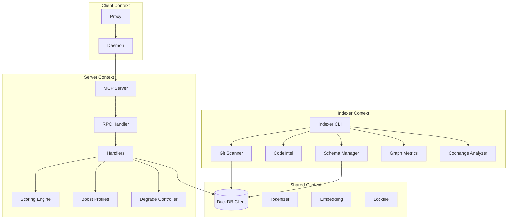
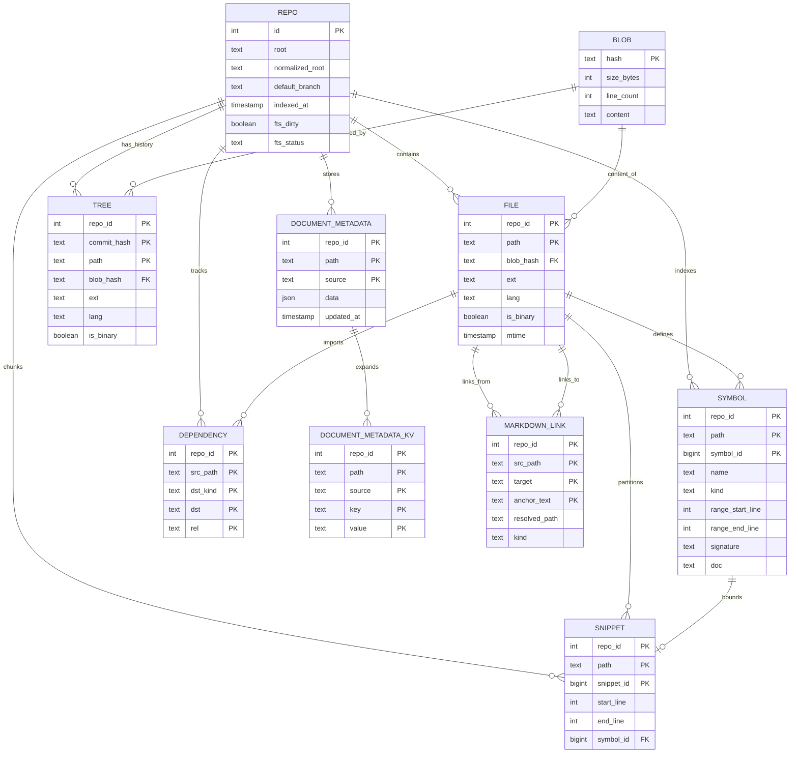
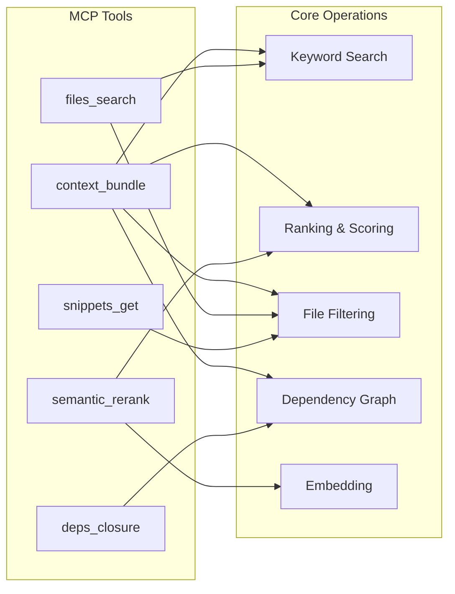
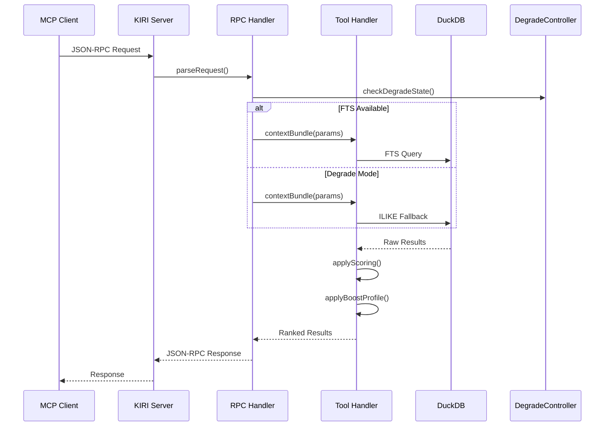
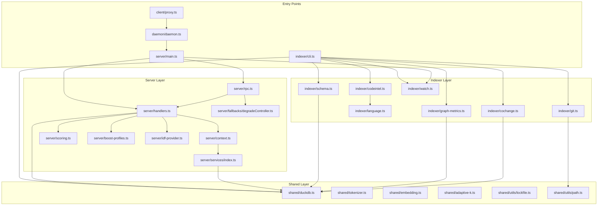

# KIRI Semantic Graph

> Domain-Centric Contextual Analysis (DCCA) による KIRI プロジェクトの意味グラフ

## 1. Domain Overview

KIRI is a **Context Extraction Platform for LLMs** that indexes Git repositories into DuckDB and provides MCP (Model Context Protocol) tools for semantic code search.

**Key Design Principle**: Degrade-first architecture - the system must work without VSS/FTS extensions.

## 2. Bounded Contexts



## 3. Entity Relationship Diagram



## 4. Core Domain Entities

### 4.1 Indexer Domain

```
[Semantic Graph: Indexer Domain]

## Entities
- Repository: Git repository to be indexed
  - id: INTEGER [PRIMARY KEY, AUTO_INCREMENT]
  - root: TEXT [NOT NULL, UNIQUE]
  - normalized_root: TEXT [UNIQUE]
  - indexed_at: TIMESTAMP

- Blob: Content-addressable file content
  - hash: TEXT [PRIMARY KEY, SHA256]
  - content: TEXT [nullable for binary]
  - size_bytes: INTEGER
  - line_count: INTEGER

- File: HEAD state of repository files
  - repo_id: INTEGER [FK -> Repository]
  - path: TEXT [relative to repo root]
  - blob_hash: TEXT [FK -> Blob]
  - lang: TEXT [detected language]
  - is_binary: BOOLEAN

- Symbol: AST-extracted code elements
  - symbol_id: BIGINT [sequential within file]
  - name: TEXT
  - kind: TEXT [function|class|method|interface|enum]
  - range_start_line: INTEGER [1-based]
  - range_end_line: INTEGER [1-based]
  - signature: TEXT [max 200 chars]
  - doc: TEXT [docstring/comment]

- Snippet: Line-range code chunks
  - snippet_id: BIGINT [sequential within file]
  - start_line: INTEGER [1-based]
  - end_line: INTEGER [1-based]
  - symbol_id: BIGINT [nullable, FK -> Symbol]

- Dependency: Import/require relationships
  - src_path: TEXT [importing file]
  - dst_kind: TEXT [path|package]
  - dst: TEXT [resolved path or package name]
  - rel: TEXT [import|require|include]

## Relationships
- Repository --[contains]--> File (1:N)
- File --[content_of]--> Blob (N:1)
- File --[defines]--> Symbol (1:N)
- File --[partitions]--> Snippet (1:N)
- Symbol --[bounds]--> Snippet (1:0..1)
- File --[imports]--> Dependency (1:N)

## Invariants
- Blob.hash must be SHA256 of content
- Symbol ranges must be within file line_count
- Snippet ranges must not overlap within file
- normalized_root is case-insensitive unique
```

### 4.2 Server Domain

```
[Semantic Graph: Server Domain]

## Entities
- ServerContext: Runtime context for request handling
  - db: DuckDBClient [connection pool]
  - repoId: INTEGER [resolved from repoRoot]
  - services: ServerServices [shared services]
  - features: FeatureFlags [fts enabled, etc.]
  - tableAvailability: TableAvailability [schema state]
  - warningManager: WarningManager [per-request]

- ServerServices: Shared service container
  - repoRepository: RepoRepository [data access]
  - repoResolver: RepoResolver [path -> id]
  - domainTerms: DomainTermsDictionary [aliases]
  - stopWords: StopWordsService [filtering]

- ScoringWeights: Ranking configuration
  - textMatch: FLOAT [keyword search weight]
  - pathMatch: FLOAT [path keyword weight]
  - editingPath: FLOAT [current file boost]
  - dependency: FLOAT [import relationship]
  - proximity: FLOAT [same directory]
  - structural: FLOAT [LSH similarity]
  - graphInbound: FLOAT [dependency graph]
  - graphImportance: FLOAT [PageRank-like]

- BoostProfile: File type scoring modifiers
  - name: TEXT [default|docs|balanced|code|none]
  - pathMultipliers: PathMultiplier[]
  - extensionPenalties: Map<ext, multiplier>

- DegradeState: Graceful degradation status
  - active: BOOLEAN
  - reason: TEXT [null if not degraded]
  - since: TIMESTAMP

## Relationships
- ServerContext --[uses]--> ServerServices (1:1)
- ServerContext --[contains]--> DuckDBClient (1:1)
- Handler --[reads]--> ScoringWeights (N:1)
- Handler --[applies]--> BoostProfile (N:1)
- RpcHandler --[monitors]--> DegradeState (N:1)

## Behaviors
- ServerContext.resolveRepo(): Resolve path to repoId
- ScoringWeights.calculateScore(): Compute ranked score
- DegradeController.enterDegrade(): Activate fallback mode
- WarningManager.warnOnce(): Deduplicated warnings
```

### 4.3 CodeIntel Domain

```
[Semantic Graph: CodeIntel Domain]

## Entities
- LanguageAnalyzer: Language-specific parser interface
  - language: TEXT [TypeScript|Swift|PHP|Java|Rust|Dart]
  - analyze(): AnalysisContext -> AnalysisResult
  - dispose(): void [optional cleanup]

- AnalysisContext: Parser input
  - pathInRepo: TEXT [relative path]
  - content: TEXT [file content]
  - fileSet: Set<TEXT> [indexed files for resolution]
  - workspaceRoot: TEXT [optional, for LSP]

- AnalysisResult: Parser output
  - symbols: SymbolRecord[]
  - snippets: SnippetRecord[]
  - dependencies: DependencyRecord[]
  - status: TEXT [success|error|sdk_unavailable]
  - error: TEXT [optional error message]

- LanguageRegistry: Central analyzer registry
  - analyzers: Map<lang, LanguageAnalyzer>
  - register(): Add analyzer
  - getAnalyzer(): Lookup by language

## Relationships
- LanguageRegistry --[manages]--> LanguageAnalyzer (1:N)
- LanguageAnalyzer --[produces]--> AnalysisResult (1:N)
- AnalysisResult --[contains]--> SymbolRecord (1:N)
- AnalysisResult --[contains]--> SnippetRecord (1:N)
- AnalysisResult --[contains]--> DependencyRecord (1:N)

## Invariants
- LanguageAnalyzer must be stateless or thread-safe
- Parse errors return empty result, never throw
- SymbolRecord.signature max 200 characters
```

## 5. MCP Tools (Aggregate Roots)



## 6. Data Flow Architecture



## 7. Module Dependency Graph



## 8. Aggregates and Value Objects

### Aggregates (with their invariants)

| Aggregate Root   | Entities                                            | Invariants                                                                     |
| ---------------- | --------------------------------------------------- | ------------------------------------------------------------------------------ |
| `Repository`     | Blob, Tree, File, Symbol, Snippet, Dependency       | `normalized_root` must be unique; all child entities reference valid `repo_id` |
| `ServerContext`  | DuckDBClient, ServerServices, WarningManager        | `repoId` must exist in database; features reflect actual DB capabilities       |
| `AnalysisResult` | SymbolRecord[], SnippetRecord[], DependencyRecord[] | Symbol ranges must be valid; snippets must not overlap                         |
| `ScoringWeights` | (value object properties)                           | All weights >= 0; penalty multipliers <= 1.0; boost multipliers >= 1.0         |

### Value Objects

| Value Object        | Properties                                            | Constraints                 |
| ------------------- | ----------------------------------------------------- | --------------------------- |
| `PathMultiplier`    | prefix, multiplier                                    | multiplier > 0              |
| `SymbolRecord`      | symbolId, name, kind, range, signature, doc           | signature max 200 chars     |
| `SnippetRecord`     | startLine, endLine, symbolId                          | startLine <= endLine        |
| `DependencyRecord`  | dstKind, dst, rel                                     | dstKind in [path, package]  |
| `DegradeState`      | active, reason, since                                 | reason required when active |
| `FtsStatusCache`    | ready, schemaExists, anyDirty, lastChecked            | lastChecked is epoch ms     |
| `TableAvailability` | hasMetadataTables, hasLinkTable, hasGraphMetrics, ... | boolean flags               |

## 9. Cross-Cutting Concerns

### 9.1 Degrade-First Architecture

- System must function without FTS/VSS extensions
- `DegradeController` monitors extension availability
- Handlers fall back to ILIKE queries when FTS unavailable

### 9.2 Security

- `.env*`, `*.pem`, `secrets/**` patterns filtered by indexer
- Sensitive paths masked with `***` in MCP responses
- `maskValue()` applied to response data

### 9.3 Observability

- Prometheus metrics via `MetricsRegistry`
- Tracing via `withSpan()` wrapper
- Adaptive K selection metrics: `adaptive_k_selected_total`, `adaptive_k_deviation_total`

### 9.4 Performance

- Token efficiency: compact mode, snippets-on-demand
- IDF caching in `DuckDbIdfProvider`
- Scoring profile caching at startup
- WAL checkpointing on connection close
